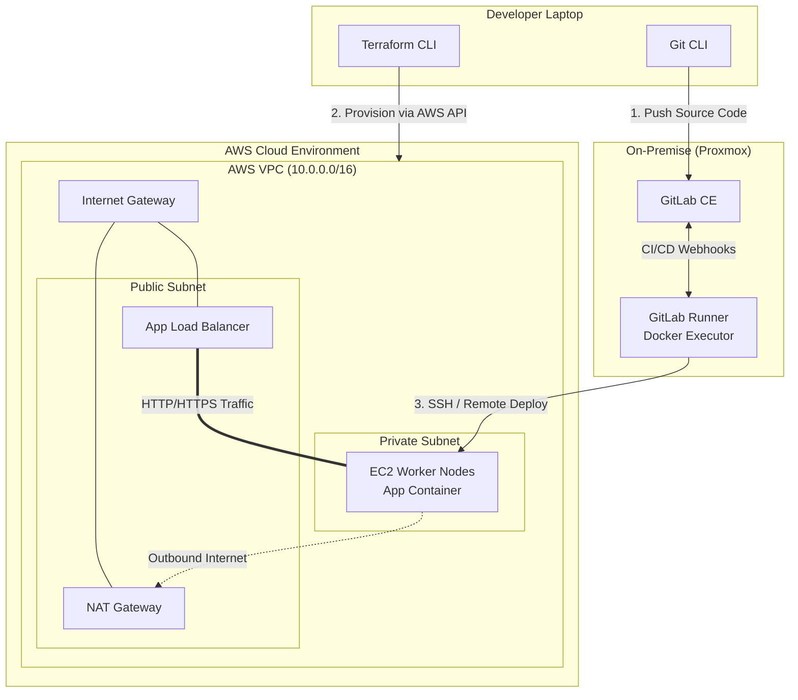

# Hybrid Cloud Infrastructure Automation

## 📌 Project Overview
This repository documents the end-to-end implementation of a Hybrid Cloud DevOps architecture. The objective is to transition from manual, legacy provisioning to a fully automated, scalable, and resilient Infrastructure as Code (IaC) environment. 

The architecture bridges an **On-Premise Control Plane** (handling source code management, CI/CD pipelines, and observability) with an **AWS Public Cloud Data Plane** (handling workloads and application deployments).

## 🏗️ Architecture Design

**Control Plane (On-Premise / Proxmox):**
* **GitLab CE:** Self-hosted Source Code Management (SCM) and CI/CD orchestrator.
* **GitLab Runner:** Docker-based executors for pipeline automation.
* **Observability Stack:** Prometheus & Grafana for centralized metrics collection (Future Sprint).

**Data/Worker Plane (AWS Cloud):**
* **Network Foundation:** VPC, Public/Private Subnets, Route Tables, Internet Gateways.
* **Compute Resources:** EC2 Instances / EKS Clusters provisioned entirely via Terraform.
* **Security:** Strict Security Groups and IAM Role definitions.

## 🛠️ Tech Stack
* **Cloud Provider:** Amazon Web Services (AWS)
* **Infrastructure as Code (IaC):** Terraform
* **On-Premise Virtualization:** Proxmox / VMware
* **CI/CD & SCM:** GitLab, GitLab CI, GitLab Runner
* **Containerization:** Docker
* **OS:** Ubuntu Linux (22.04 / 24.04 LTS)

## 🚀 Project Roadmap & Sprints

### Sprint 1: Control Plane Foundation 🔄 *(In Progress)*
- [ ] Provision On-Premise VM for Control Plane.
- [ ] Install and configure self-hosted GitLab CE.
- [ ] Deploy and register Docker-based GitLab Runners.
- [ ] Set up AWS IAM credentials for Terraform execution.

### Sprint 2: AWS Network & Compute Automation via IaC ⏳ *(Pending)*
- [ ] Initialize Terraform backend (S3 state management).
- [ ] Write reusable Terraform modules for VPC, Subnets, and IGW.
- [ ] Provision AWS EC2/EKS worker nodes via Terraform.

### Sprint 3: CI/CD Pipeline Implementation ⏳ *(Pending)*
- [ ] Containerize a dummy microservices application (`Dockerfile`).
- [ ] Create `.gitlab-ci.yml` for automated Build, Test, and Push to Container Registry.
- [ ] Automate deployment to AWS worker nodes.

### Sprint 4: Observability & Monitoring ⏳ *(Pending)*
- [ ] Deploy Prometheus to scrape metrics from AWS and On-Premise nodes.
- [ ] Configure Grafana dashboards for real-time visualization.
- [ ] Set up automated alerting (e.g., via Telegram/WhatsApp webhook).

---
*Developed and maintained by [Your Name] as part of a continuous cloud engineering growth initiative.*